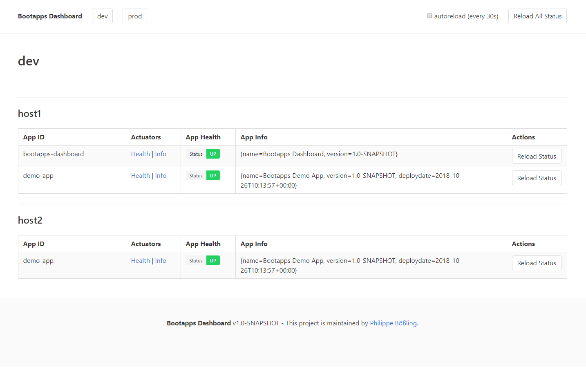

# Bootapps Dashboard

A simple dashboard for displaying health status and application info of multiple Spring Boot applications.



## Requirements

- JDK 8
- ECMAScript 6 compatible browser

## Local Development

Run from source via Spring-Boot-Maven-Plugin:

```
./mvnw spring-boot:run
```

Or build and run from packaged JAR:

```
./mvnw package && java -jar target/bootapps-dashboard-1.0-SNAPSHOT.jar
```


## Installation

Either build the JAR from [source](https://github.com/pboessling/bootapps-dashboard/releases) or download the latest 
[release](https://github.com/pboessling/bootapps-dashboard/releases) and copy the JAR file to the desired folder.

Then start the application with the `java -jar` command. 

Within the classpath of the application there is an application properties file `application.yml` containing the default
configuration of the application. In order to override the default configuration and to add bootapps to the dashboard, 
you need to provide an external application properties file.

If this external application properties file is called `application.yaml` and located in the same  folder from which the 
application is started, it will automatically be picked up, when starting the application. 

Example:
```
java -jar bootapps-dashboard-1.0-SNAPSHOT.jar
```

If the external properties file has a different name and/or is located in a different folder than the one from which the
application is started, the location of all properties files, both the one on the classpath and the external one in the 
filesystem needs to be provided as additional parameter, in order to be picked up, when starting the application.

Example:
```
java -jar bootapps-dashboard-1.0-SNAPSHOT.jar --spring.config.location=classpath:/application.yml,file:./application.yml
```

## Configuration

### server

The `server` namespace contains standard Spring Boot application properties for configuring the embedded Tomcat server, 
in which the webapp is running.

| Property  | Default Value | Description |
| ------------- | ------------- | ------------- |
| port  | 8080  | The port on which the webapp is running. |

Example:
```yaml
server:
  port: 8080
```

### dashboard

The `dashboard` namespace contains application properties for configuring the Bootapps Dashboard application.

| Property  | Default Value | Description |
| ------------- | ------------- | ------------- |
| autoreload | false | Whether the status of the bootapps on the dashboard should automatically be reloaded. |
| autoreload-interval | 30000 | If autoreload is enabled, the interval in milliseconds between two reloads. |
| bootapps | \<none\> | Connection details for the bootapps to be displayed on the dashboard. |

Example:
```yaml
dashboard:
  autoreload: false
  autoreload-interval: 30000
  bootapps:
    dev:
      host1:
      - id: bootapps-dashboard
        health-endpoint-url: http://localhost:8080/actuator/health
        info-endpoint-url: http://localhost:8080/actuator/info
      - id: demo-app
        health-endpoint-url: http://localhost:8081/actuator/health
        health-endpoint-username: user
        health-endpoint-password: password
        info-endpoint-url: http://localhost:8081/actuator/info
        info-endpoint-username: user
        info-endpoint-password: password
      host2:
      - id: demo-app
        health-endpoint-url: http://localhost:8081/actuator/health
        health-endpoint-username: user
        health-endpoint-password: password
        info-endpoint-url: http://localhost:8081/actuator/info
        info-endpoint-username: user
        info-endpoint-password: password
    prod:
      host1:
      - id: demo-app
        health-endpoint-url: http://localhost:8081/actuator/health
        health-endpoint-username: user
        health-endpoint-password: password
        info-endpoint-url: http://localhost:8081/actuator/info
        info-endpoint-username: user
        info-endpoint-password: password
```

## Changelog

**1.0**

* Initial release.

## License

[MIT](LICENSE)

## Author Information

Created by [Philippe Bößling](https://www.gihub.com/pboessling).